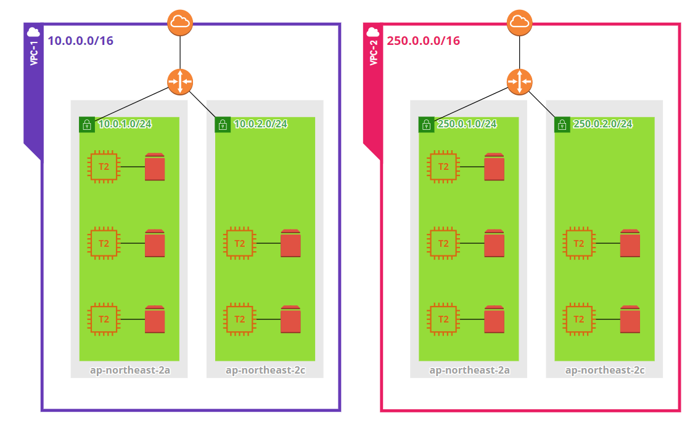

# How to

## On CLI

### 010-provider.tf

* Make credential file at "~/.aws/credentials"

```
$ mkdir ~/.aws
$ vi ~/.aws/credentials
[default]
aws_access_key_id=AB67...45Z
aws_secret_access_key=01ef...7kY
```

### 011-var-network.tf

"vpc_list"와 "subnet_list"는 list of map 형태로써 하나의 map은 하나의 vpc 혹은 subnet을 구성하게 된다.

* Configure vpc variable

생성하고자 하는 vpc의 정보를 "vpc_list" 안에 아래와 같은 map 형태로 작성해준다.

```
{
  "vpc_name" = "vpc의 name" # must be unique
  "vpc_cidr" = "vpc의 cidr" # must be unique
}
```

* Configure subnet variable

생성하고자 하는 subnet의 정보를 "subnet_list" 안에 아래와 같은 map 형태로 작성해준다.

```
{
  "subnet_name" = "subnet의 name" # must be unique
  "which_vpc"   = "subnet이 위치할 vpc의 이름" # 위에서 생성한 vpc의 이름
  "subnet_cidr" = "subnet의 cidr" # 지정한 vpc의 cidr보다 작게 설정
  "subnet_az"   = "subnet이 위치할 availability_zone" # subnet은 하나의 az만을 갖을 수 있다.
}
```

### 012-var-instance.tf

"instance_list"는 list of map 형태로써 하나의 map은 하나의 instance를 구성하게 된다.

* Configure instance variable

생성하고자 하는 instance의 정보를 "instance_list" 안에 아래와 같은 map 형태로 작성해준다.

```
#TODO : root_volume_size을 0으로 설정하면 OS 부팅을 위한 최소 사이즈로 instance 생성
#TODO : additional_volume을 0으로 설정하면 volume 추가 생성 및 attach 단계 없게끔
{
  "vm-name" = "instance의 이름"
  "flavor"  = "instance의 flavor"
  "root_volume_size"  = "OS가 부팅되는 root disk의 volume size" # 단위는 GB
  "additional_volume" = "추가로 attach할 volume size" # 단위는 GB
  "subnet_name" = "instance가 위치할 subnet 이름" # 위에서 생성한 subnet의 이름
}
```

### 013-var-ami.tf

사용하고자 하는 ami의 id를 설정해두는 곳, filter 기능을 통해 조건에 맞는 ami 중 최신 버전을 사용하게끔 스크립트를 작성할 수도 있으나 그렇게 하지 않았음.

### 020-ssh-key.tf

ec2 key-pair를 생성하는 곳. instance 생성 시 keypair 등록이 필수적이다. ec2에 이미 생성된 key-pair를 사용하고자 한다면 key_name으로 검색하여 사용하면 된다.
```
data "aws_key_pair" "terraform" {
  key_name = "terraform"
}
# instance 생성시 key-pair 지정법
  key_name = data.aws_key_pair.terraform.key_name
```
* Configure key-pair variable

로컬에 key-pair가 있는 경우
```
본인의 public_key 값을 복사하여 붙여넣어 준다.
  public_key = "ssh-rsa AAAA~~~"

line 5에 주석처리된 것처럼 path를 지정해서 쓸 수도 있다.
  public_key = file("~/.ssh/id_rsa.pub")
```

로컬에 key-pair가 없는 경우
```
$ cd ~/.ssh
$ ssh-keygen
Enter -> Enter -> Enter
생성된 public_key를 사용한다.
```

로컬에 private_key는 있으나, public_key가 없는 경우
```
# private_key로 public_key를 생성해준다.
$ cd ~/.ssh
$ ssh-keygen -f id_rsa -y > id_rsa.pub
생성된 public_key를 사용한다.
```

## On Web UI(Cloud/Enterprise)

위 CLI와 마찬가지로 설정을 마쳐준다.local path를 사용할 수 없으므로 credential은 Environment Variable로 입력해준다.
```
AWS_ACCESS_KEY_ID = ~~~
# 시크릿키를 입력할 때는 'SENSITIVE'를 체크하여 노출되지 않도록 한다.
AWS_SECRET_ACCESS_KEY = ~~~
```

### Create stack

```
$ terraform apply
yes
```



### Delete stack

```
$ terraform destroy
yes
```
